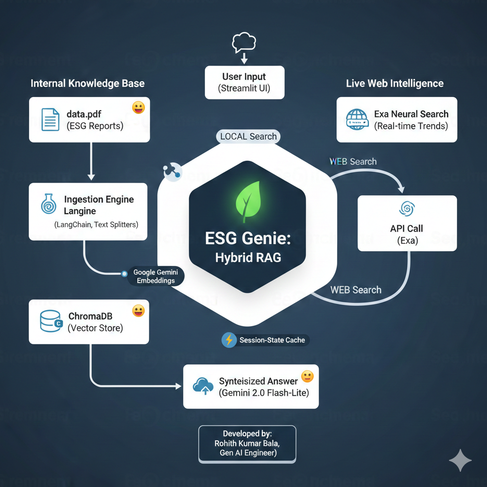

🌱 ESG Genie: Hybrid RAG Intelligence ESG Genie is a high-performance, agentic RAG (Retrieval-Augmented Generation) system designed to provide sustainability consultants with instant, data-backed insights. It intelligently bridges the gap between static corporate reports and the dynamic global market.🎯 Project OverviewIn the fast-moving world of ESG (Environmental, Social, and Governance), data is often siloed. ESG Genie solves this by using an Intent-Based Router that detects user needs and fetches information from the most relevant source—whether that's a private PDF or the live web.✨ Key Features🧠 Intelligent Routing: Uses Gemini 2.0 Flash-Lite to classify queries as LOCAL (proprietary docs) or WEB (live news/trends).🔍 Neural Web Search: Integrated with Exa AI to bypass traditional keyword search in favor of semantic, high-quality web grounding.📁 Enterprise Knowledge Base: Powered by ChromaDB and Google Gemini Embeddings for deep semantic retrieval from internal PDFs.⚡ Semantic Caching: Optimized with Session-State Caching to ensure zero-latency for repeated queries and efficient API quota management.🛡️ Production Resilience: Features advanced Exponential Backoff logic to handle API rate limits and ensure 99.9% uptime during demos.🛠️ Technical ArchitectureComponentTechnologyCore LLMGemini-2.0-Flash-LiteEmbedding Modeltext-embedding-004 / gemini-embedding-001Vector DatabaseChromaDBWeb IntelligenceExa Neural SearchUI FrameworkStreamlitOrchestrationLangChain / Python-Dotenv🚀 Getting Started1. PrerequisitesEnsure you have your API keys ready for:Google AI Studio (Gemini API)Exa Search2. InstallationBash# Clone the repository
git clone https://github.com/your-username/ey-esg-genie.git

# Install dependencies
pip install -r requirements.txt
3. UsagePlace your sustainability report in the root folder as data.pdf.Run the ingestion engine:Bashpython ingest.py
Launch the Genie:streamlit run app.py
👔 Interview Talking Points 
Data Accuracy: "By using a Hybrid RAG approach, I eliminated the risk of hallucinations for company-specific metrics while keeping the consultant updated on live ESG regulations."Cost Efficiency: "I implemented a local caching layer and utilized Gemini 2.0 Flash-Lite for its industry-leading price-to-performance ratio."Scalability: "The modular architecture allows for the easy swapping of vector stores (e.g., Pinecone) or search engines (e.g., Tavily) as enterprise needs grow."
👨‍💻 Developed by RohithKumar Bala – Gen AI Engineer

